# Agile Avatars

WORK IN PROGRESS.

Source code for [agileavatars.com](https://agileavatars.com). An experiment in frameworkless/vanilla JavaScript.


[](https://codecov.io/gh/mattriley/agileavatars)


> Agile Avatars makes it quick and easy to know who's working on what with great looking avatars for your agile board. No more fiddling with Word or Google Docs making sure everything aligns just right. Simply drag and drop your images, make some adjustments, print, and laminate!

This is a hobby project I decided to double as an experiment in developing a web application in JavaScript without the aid of a framework like React or Angular. Such an approach is often referred to as frameworkless, or vanilla JavaScript.

DISCLAIMER: Some of the approaches used may be unconventional. Any attempt to emulate these approaches should be done with the unique needs and circumstances of your endeavour taken into consideration.

## Table of Contents

<!-- START doctoc generated TOC please keep comment here to allow auto update -->
<!-- DON'T EDIT THIS SECTION, INSTEAD RE-RUN doctoc TO UPDATE -->
<!-- END doctoc generated TOC please keep comment here to allow auto update -->

# Getting started

__Prerequisites__
- Install Node <%- nodeVersion %> or install [nvm](https://github.com/nvm-sh/nvm) and run `nvm install`
- Install dependencies: `npm install`

__Tasks__
- Run the tests: `./task test`
- Start local dev server: `./task start`
- See all available dev tasks: `ls ./tasks`

__iTerm2 automated window arrangement (macOS only)__
- Install iTermocil: `./task itermocil-install`
- Launch window arrangement: `./task itermocil`

# Design goals

- Beginner friendly. Minimise prerequisite knowledge.
- Reduce cognitive load. Simplicity. Minimalism. Organisation. Ability to maintain a mental model.
- Low maintenance. Avoid dependencies that could impact the application in a material way.
- Flexibility. Avoid dependencies that take over the control flow of the application.
- Easy to change. Tests run fast. Tests are behavioural.
- Functional leaning. Avoid strict functional programming.

# Technical constraints

- No languages that compile to JavaScript; No TypeScript. 
  - [You Might Not Need TypeScript (or Static Types) - Eric Elliott](https://medium.com/javascript-scene/you-might-not-need-typescript-or-static-types-aa7cb670a77b)
  - [The Shocking Secret About Static Types - Eric Elliott](https://medium.com/javascript-scene/the-shocking-secret-about-static-types-514d39bf30a3)
- No frameworks, view libraries, state management libraries; No Angular, React, Redux.
- No globals. Access to `window` strictly controlled.
- No classes. Prefer partial application.
  - [Curry and Function Composition - Eric Elliott](https://medium.com/javascript-scene/curry-and-function-composition-2c208d774983)
- No `..` in require paths in `src` and `tests`. Minimise `..` in paths in general.
- Layered architecture for separation of concerns.
  - [PresentationDomainDataLayering - Martin Fowler](https://martinfowler.com/bliki/PresentationDomainDataLayering.html)
- Service functions are imperative shells.
  - [Functional Core, Imperative Shell - Gary Bernhardt](https://www.destroyallsoftware.com/screencasts/catalog/functional-core-imperative-shell)
- Module composition confined to a composition root.
  - [Composition Root - Mark Seemann](https://blog.ploeh.dk/2011/07/28/CompositionRoot/)
- Autogenerated `index.js` to aggregate siblings into an object graph. 

# Architecture

With the plethora of frontend architectural styles in use today, this application takes a "back to basics" approach with a classic layered architecture. My hypothesis is that the simplicity and familiarity of this architectural style would be approachable for a wide audience including backend developers with limited exposure to frontend development.


## Modules

The application is composed of architectural components called modules. Each directory under `src` is a module, with `components` and `services` being examples. Modules __do not__ reference other modules using file references. Rather, the application begins with an initialisation process where modules are composed using a functional programming technique called partial function application. See [Initialisation](#initialisation) for more details.

Following is a complete list of modules.

<%- modules %>

# Initialisation

Initialisation is the process of making the application ready to launch and involves: 

- Loading configuration,
- Composing modules,
- Invoking startup procedures, and
- Returning the initialised modules / the integrated application.

Launching the application involves invoking the _root_ component (which in turn invokes many other subcomponents) and appending it to the DOM. Separating the concern of initialising from launching provides:

- A means of understanding how the application "hangs together".
- A means of testing isolated behaviours in an integrated setting.

## Initialising the application with boot()

The application is initialised by invoking the function exported by `./boot.js`. `boot()` must be supplied a `window` object. The entire application depends on this supplied instance of `window` rather than depending on the global `window` object.

<%- renderJsFile('boot.js') %>

`module-composer` is a small, single-file library that enables module composition using partial function application. Originally part of Agile Avatars but extracted as a separate library because I've found it useful in other projects. See [module-composer](#-module-composer) in the [Dependencies](#dependencies) section.

__Source code for module-composer__

<%- renderJsFile('node_modules/module-composer/src/module-composer.js', { open: false }) %>

## Understanding the application

`boot.js` is also useful as a single place to go to control and understand how the application "hangs together", helping to reduce cognitive load.

An interesting side-effect of managing dependencies this way is that it became trivial to generate a dependency diagram. This is achived by invoking `boot()` and using a data structure provided by `module-composer` that describes the dependencies to generate a [mermaid.js](https://github.com/mermaid-js/mermaid) definition file, and using [mermaid-cli](https://github.com/mermaid-js/mermaid-cli) to generate an SVG. See [mermaid-cli](#-mermaid-jsmermaid-cli) in the [Dependencies](#dependencies) section.



## Launching the application

A single HTML file at `./public/index.html` loads `./public/app.js` using a `<script>` tag. `app.js` initialises the application by invoking `boot()`, supplying the global `window` object as an argument. Once initialised, the `components` module is used to create the top level `app` component and appends it to the DOM. The `services` module is also used to activate the `welcome` modal. 

<%- renderJsFile('public/app.js') %>

The initialised application is also assigned to `window.agileavatars` for debugging purposes:


This can also be used to view the current state of the application:


## Testing the application

Rather than acting on individual files, tests act on the initialised application. 

__Example: A component test that depends on shared state__

This test initialises the application by invoking `boot()` and uses the `components` module to create an 'options bar' which should initially be hidden. It then uses the `services` module to insert a tag which should cause the options bar to become visible. 

<%- renderJsFile('tests/components/options-bar.test.js') %>

NB: As mentioned previously, `boot()` has 1 required argument - `window`. This version of `boot()` is actually a wrapper that supplies an instance of `window` provided by [JSDOM](https://github.com/jsdom/jsdom) to the original `boot` function for testing purposes.

__Example: A service test that depends on IO__

TODO

# View rendering

View rendering is achieved primarily using the DOM API - `document.createElement()`, and by exception using HTML strings - `element.innerHTML`.

## DOM API - document.createElement()

Creating elements with the DOM API usually involves:

- Creating an element, `document.createElement('div')`
- Assigning a class name, `element.className = 'myclass'`
- Assigning properties, `element.prop1 = 'foo'`
- Appending child elements, `element.append(child1, child2)`
- Adding event listeners, `element.addEventListener('click', clickHandler)`

This approach is sometimes criticised as verbose. While I only considered the verbosity a minor concern, I did notice a pattern emerge which lead me to the creation of a helper function, `el()`.

### Creating elements with el()

`el()` takes a tag name, an optional class name, and optional properties object. Because the native `append()` and `addEventListener()` functions return undefined, `el()` overrides them to return the element instead to enable function chaining.

__Example: Usage of el()__

```js
const $div = el('div', 'myclass', { prop1: 'foo', prop2: 'bar' })
    .append(child1, child2)
    .addEventListener('focus', focusHandler)
    .addEventListener('click', clickHandler);
```

The equivalent without `el()`:

```js
const $div = document.createElement('div');
$div.className = 'myclass';
$div.prop1 = 'foo';
$div.prop2 = 'bar';
$div.append(child1, child2);
$div.addEventListener('focus', focusHandler);
$div.addEventListener('click', clickHandler);
```

__el() implementation__

<%- renderJsFile('src/ui/el.js') %>

### Observations

#### No id required on elements. No need to query for elements.

Because ultimately this approach uses `document.createElement` to create elements, and all interaction with elements are encapsulated within builder functions, we always have a direct reference to the element. This eliminates the need to assign an id, or lookup elements using `document.getElementById` or `document.querySelector` or some variation of these.

## HTML strings - element.innerHTML

`element.innerHTML` is used by exception, where HTML is used primarily for marking up blocks of content.

__Example: Usage of innerHTML for content__

This example uses `el()` to create an element, but assigns a HTML string to `innerHTML` rather than appending child elements.

<%- renderJsFile('src/components/tips/naming.js') %>

# State management

Avoiding state management libraries forces the need for a bespoke state management solution.
No attempt is made to generify the state management solution for reuse by other applications; rather it is designed to evolve with the specific needs of this application.

## Stores

State is managed by a series of _state stores_. 

A **state store** is collection of data items keyed by a unique identifier and managed using typical CRUD operations such as `insert`, `find`, `update`, `remove`.

<%- renderJsFile('src/storage/state-store.js', { open: false }) %>

__Example: Inserting a role using insert()__

<%- renderJsFile('src/services/roles/insert-role.js') %>

__Example: Changing a role name using find() and update()__

<%- renderJsFile('src/services/roles/change-role-name.js') %>

## Subscriptions

State stores use the [observer pattern](https://en.wikipedia.org/wiki/Observer_pattern) to enable consumers to react to state changes by associating _listener_ functions to events such as `onInsert` and `onChange`.

The observer pattern is easily implemented with Node's [EventEmitter](https://nodejs.org/api/events.html) which can be bundled directly into the application.

During startup, subscription functions are extracted from the stores into a standalone _subscriptions_ object. This decouples subscribers (namely _services_ and _components_) from the stores making them agnostic of the data source. Although not a design goal for this application, this should allow the data source to change without impacting the subscribers provided the interface of the subscription functions do not change.

__Example: Reacting to a new role using onInsert() and onFirstInsert()__

<%- renderJsFile('src/components/role-list/role-list.js') %>

__Example: Reacting to the change of a role name using onChange()__

<%- renderJsFile('src/components/role-list/role-customiser/master-role-name.js') %>


# Testing 

## Position

The position taken in this application is that tests should enable __Merciless Refactoring__. The constraints below are designed to enable the application to change significantly and rapidly.

Further reading:
- [Refactoring - Martin Fowler](https://martinfowler.com/tags/refactoring.html)
- [Refactor Mercilessly - Ward Cunningham](https://wiki.c2.com/?RefactorMercilessly)
- [Refactor Mercilessly - Don Wells](http://www.extremeprogramming.org/rules/refactor.html)

## Constraints

- Unit test suite optimised for speed. Max 10 seconds.
  - [TDD test suites should run in 10 seconds or less - Mark Seemann](https://blog.ploeh.dk/2012/05/24/TDDtestsuitesshouldrunin10secondsorless/)
- No BDD style assertion libraries, e.g. expect. Used assert instead.
  - [I strongly recommend that you skip all BDD style assertion libraries - Eric Elliott](https://medium.com/@_ericelliott/i-strongly-recommend-that-you-skip-all-bdd-style-assertion-libraries-including-code-acae26344d4)
- No mocking libraries.
  - [Mocking is a code smell - Eric Elliott](https://medium.com/javascript-scene/mocking-is-a-code-smell-944a70c90a6a)
- No hooks, i.e. beforeEach, afterEach.
- No globals.

## Approach

The application is tested from the outside-in, starting with the components. A component's behaviour is tested by the effect it has on other components, treating the low level details as a black box. These are "sociable" as opposed to "solitary" unit tests.

__Example: Tips modal triggered by link in nav bar__

This test creates a 'nav bar' and a 'tips modal'; clicks the 'tips link' in the nav bar; then asserts the tips modal has a class indicating it should be visible. The mechanics behind this interaction are a black box, making it resilient to implementation changes which enables merciless refactoring.

<%- renderJsFile('tests/components/tips.test.js') %>

Not every component is tested directly. Many low level components can be treated as a black box when exercised by a higher level component. 

Components are not designed and tested as though they'll be soon extracted as a reusable component library. This means components can be tested under the conditions they're used by this application, rather than how they might hypothetically be used by unknown consumers. This reduces the testing burden by allowing us to make reasonable assumptions about interactions between components, validity of parameters/data used, etc.

The intent with black box testing is to minimise the chances of tests breaking due to implmentation changes and thereby support merciless refactoring. 

Exceptions are made to the black box approach under certain conditions:

1. System boundary
2. Narrow feedback


### 2. System boundary

Where the execution path will reach a system boundary, stub just short of the integration to avoid coupling the test to the low level implementation details of the integration.

__Example: Gravatar service functions stubbed__

This test creates a 'gravatar modal' and a 'tag list'. Clicking the 'import button' will render a tag in the tag list using data fetched from Gravatar. The `fetchProfileAsync` and `fetchImageAsync` functions are stubbed to prevent the integration from occurring and to avoid coupling the test to the implementation details of the integration. 

<%- renderJsFile('tests/components/gravatar/import-success.test.js') %>

### 3. Narrow feedback

When it's helpful to narrow down failure feedback when execution path is too coarse. e.g. state-store evolved with the application rather than being built up-front. The state-store could be covered by the component tests but it's sufficiently complicated to justify it's own tests.

This testing approach supports classic TDD more so than mockist TDD.
- [Mocks Aren't Stubs - Martin Fowler](https://martinfowler.com/articles/mocksArentStubs.html)
  - [Classical and Mockist Testing](https://martinfowler.com/articles/mocksArentStubs.html#ClassicalAndMockistTesting)
- [Classical vs Mockist testing - Jonathan Rasmusson](https://agilewarrior.wordpress.com/2015/04/18/classical-vs-mockist-testing/)
- [Mockists Are Dead. Long Live Classicists - Fabio Pereria, ThoughtWorks](https://www.thoughtworks.com/insights/blog/mockists-are-dead-long-live-classicists)

Links
- [UnitTest - Martin Fowler](https://martinfowler.com/bliki/UnitTest.html)
  - [Solitary or Sociable?](https://martinfowler.com/bliki/UnitTest.html#SolitaryOrSociable)


# Dependencies

## Position

The position taken in this application is to view depenendencies as liabilities.
That's not to say dependencies should be avoided at all costs.
The constraints below are designed to minimise dependencies and encourage due diligence in cases where dependencies might be appropriate.

Further reading:
- [Unix philosophy - Wikipedia](https://en.wikipedia.org/wiki/Unix_philosophy)
- [Dependency Management Guidelines For Rails Teams - Brandon Dees](https://blog.engineyard.com/dependency-management-guidelines-for-rails-teams)
- [3 pitfalls of relying on third-party code libraries - Andy Henson](https://www.foxsoft.co.uk/3-pitfalls-of-relying-on-third-party-code-libraries/)

## Constraints

<%- dependencies.constraints %>

The following sections lists all dependencies, including:

- Description and Homepage taken from package.json.
- Number of production dependencies followed by:
  - :boom: = 0 dependencies, :white_check_mark: = 1-9 dependencies, :warning: = 10+ dependencies
  - NB: There's no science behind these numbers. This is simply a guide to help keep the number of dependencies low.
  - NB: It would be even better to list the total number of dependencies in the entire dependency tree.
- Description of what the dependency is used for.
- Clarifying comments against the constraints listed above.
  
## Production dependencies

<%- dependencies.production %>

## Development dependencies

<%- dependencies.development %>

# Conventions

## Code

### Prefix $ to variables storing HTML element and $$ for collections of HTML elements

I generally prefer to avoid variable prefixes but I've found these prefixes help in a couple of ways:

1. Improves visual scanning of code making it faster to interpret.
2. Avoids naming conflicts, e.g. `$tagName.textContext = tagName;`

### Clarifying comments as footnotes

Such comments are secondary to the code and so follow the code rather than preceed it.

<%- renderJsFile('src/components/tag-list/tag/components/tag-image.js', { includeFootnotes: true }) %>

### Async functions end with the word Async

This just makes it easier to know when to use `await`.

### Functional programming

- Prefer `const` over `let`, and avoid `var`.
- Prefer higher-order functions such as `filter`, `map`, `reduce`, over imperative looping statements.
- Separate pure from impure functions.

## Documentation

- Append `()` to function names to make it obvious we are referring to a function, e.g. `func()`
- Avoid using code style in headings, e.g. __About func()__, not __About `func()`__
- Prefix ❖ to lists of level 3 heading to make them stand out as bullet items
- Wherever possible render actual source files for example code.
