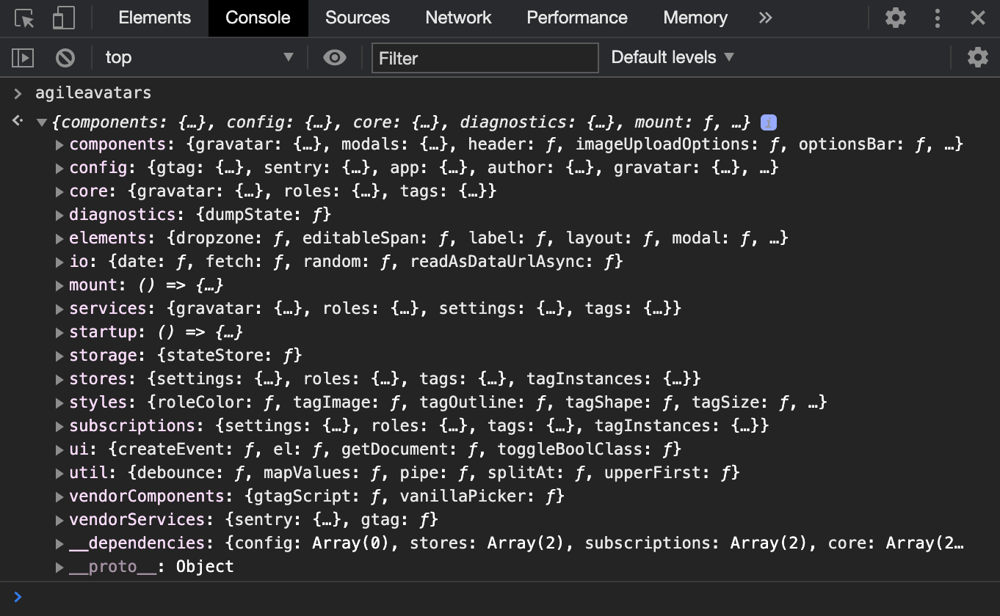
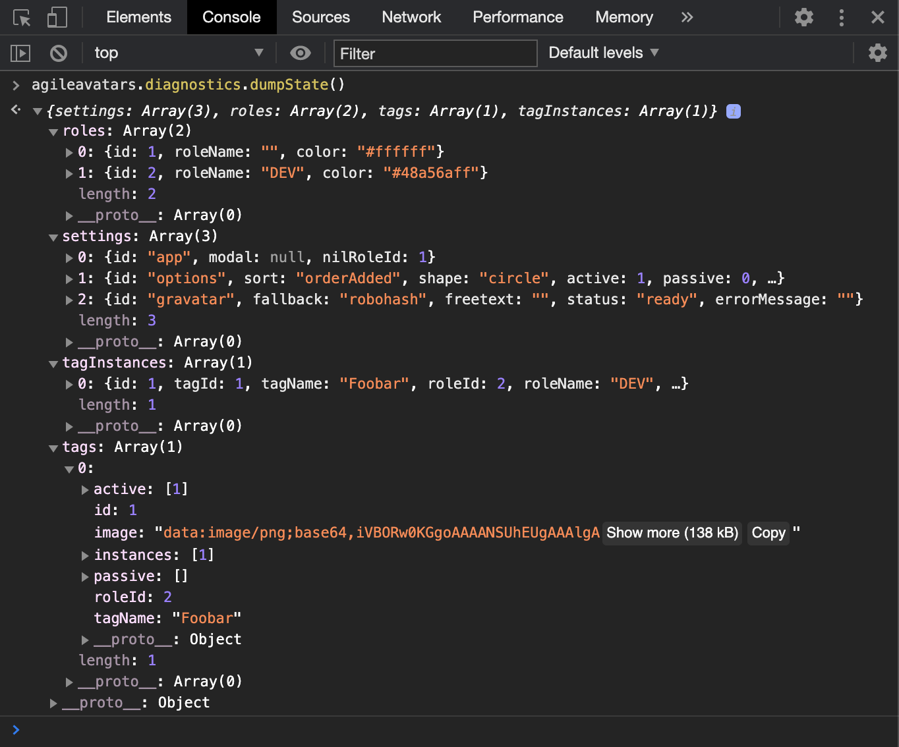

# Agile Avatars

WORK IN PROGRESS.

Source code for [agileavatars.com](https://agileavatars.com). An experiment in frameworkless/vanilla JavaScript.


[](https://codecov.io/gh/mattriley/agileavatars)


> Agile Avatars makes it quick and easy to know who's working on what with great looking avatars for your agile board. No more fiddling with Word or Google Docs making sure everything aligns just right. Simply drag and drop your images, make some adjustments, print, and laminate!

This is a hobby project I decided to double as an experiment in developing a web application in JavaScript without the aid of a framework like React or Angular. Such an approach is often referred to as frameworkless, or vanilla JavaScript.

DISCLAIMER: Some of the approaches used may be unconventional. Any attempt to emulate these approaches should be done with the unique needs and circumstances of your endeavour taken into consideration.

## Table of Contents

<!-- START doctoc generated TOC please keep comment here to allow auto update -->
<!-- DON'T EDIT THIS SECTION, INSTEAD RE-RUN doctoc TO UPDATE -->
<!-- END doctoc generated TOC please keep comment here to allow auto update -->

- [Getting started](#getting-started)
- [Design goals](#design-goals)
- [Technical constraints](#technical-constraints)
- [Architecture](#architecture)
  - [Modules](#modules)
- [Initialisation](#initialisation)
  - [Initialising the application with boot()](#initialising-the-application-with-boot)
  - [Understanding the application](#understanding-the-application)
  - [Launching the application](#launching-the-application)
  - [Testing the application](#testing-the-application)
- [View rendering](#view-rendering)
  - [DOM API - document.createElement()](#dom-api---documentcreateelement)
  - [HTML strings - element.innerHTML](#html-strings---elementinnerhtml)
- [State management](#state-management)
  - [Stores](#stores)
  - [Subscriptions](#subscriptions)
- [Testing](#testing)
  - [Position](#position)
  - [Constraints](#constraints)
  - [Approach](#approach)
- [Dependencies](#dependencies)
  - [Position](#position-1)
  - [Constraints](#constraints-1)
  - [List of production dependencies](#list-of-production-dependencies)
  - [List of development dependencies](#list-of-development-dependencies)
- [Functional programming](#functional-programming)
  - [Immutability](#immutability)
  - [Higher-order functions](#higher-order-functions)
  - [Pure functions](#pure-functions)
  - [Pipe](#pipe)
- [Conventions](#conventions)
  - [Code](#code)
  - [Documentation](#documentation)

<!-- END doctoc generated TOC please keep comment here to allow auto update -->

# Getting started

__Prerequisites__
- Install Node 14.4.0 or install [nvm](https://github.com/nvm-sh/nvm) and run `nvm install`
- Install dependencies: `npm install`

__Tasks__
- Run the tests: `./task test`
- Start local dev server: `./task start`
- See all available dev tasks: `ls ./tasks`

__iTerm2 automated window arrangement (macOS only)__
- Install iTermocil: `./task itermocil-install`
- Launch window arrangement: `./task itermocil`

# Design goals

- Beginner friendly. Minimise prerequisite knowledge.
- Reduce cognitive load. Simplicity. Minimalism. Organisation. Ability to maintain a mental model.
- Low maintenance. Avoid dependencies that could impact the application in a material way.
- Flexibility. Avoid dependencies that take over the control flow of the application.
- Easy to change. Tests run fast. Tests are behavioural.
- Functional leaning. Avoid strict functional programming.

# Technical constraints

- No languages that compile to JavaScript; No TypeScript. 
  - [You Might Not Need TypeScript (or Static Types) - Eric Elliott](https://medium.com/javascript-scene/you-might-not-need-typescript-or-static-types-aa7cb670a77b)
  - [The Shocking Secret About Static Types - Eric Elliott](https://medium.com/javascript-scene/the-shocking-secret-about-static-types-514d39bf30a3)
- No frameworks, view libraries, state management libraries; No Angular, React, Redux.
- No functional programming libraries. e.g. [Rambda.js](https://github.com/ramda/ramda), [Immutable.js](https://github.com/immutable-js/immutable-js)
- No globals. Access to `window` strictly controlled.
- No classes. Prefer partial application.
  - [Curry and Function Composition - Eric Elliott](https://medium.com/javascript-scene/curry-and-function-composition-2c208d774983)
- No `..` in require paths in `src` and `tests`. Minimise `..` in paths in general.
- Layered architecture for separation of concerns.
  - [PresentationDomainDataLayering - Martin Fowler](https://martinfowler.com/bliki/PresentationDomainDataLayering.html)
- Service functions are imperative shells.
  - [Functional Core, Imperative Shell - Gary Bernhardt](https://www.destroyallsoftware.com/screencasts/catalog/functional-core-imperative-shell)
- Module composition confined to a composition root.
  - [Composition Root - Mark Seemann](https://blog.ploeh.dk/2011/07/28/CompositionRoot/)
- Autogenerated `index.js` to aggregate siblings into an object graph. 

# Architecture

With the plethora of frontend architectural styles in use today, this application takes a "back to basics" approach with a classic layered architecture. My hypothesis is that the simplicity and familiarity of this architectural style would be approachable for a wide audience including backend developers with limited exposure to frontend development.


## Modules

The application is composed of architectural components called modules. Each directory under `src` is a module, with `components` and `services` being examples. Modules __do not__ reference other modules using file references. Rather, the application begins with an initialisation process where modules are composed using a functional programming technique called partial function application. See [Initialisation](#initialisation) for more details.

Following is a complete list of modules.

### ❖ components

An aggregation of _component builder functions_.

A __component builder function__ returns an object deriving [HTMLElement](https://developer.mozilla.org/en-US/docs/Web/API/HTMLElement) set up to react to both user interaction and state changes (via subscriptions), may self-mutate, and interact with services.

<details open>
<summary>src/components/tag-list/tag/components/tag-name.js</summary>

```js
module.exports = ({ elements, services, subscriptions }) => tagInstanceId => {

    const $tagName = elements.editableSpan('tag-name')
        .addEventListener('change', () => {
            services.tags.changeTagName(tagInstanceId, $tagName.textContent);
        });

    subscriptions.tagInstances.onChange(tagInstanceId, 'tagName', tagName => {
        $tagName.textContent = tagName;
    });

    return $tagName;

};
```
</details>

Because component builder functions simply return native HTML elements, they can easily be appended to create component hierarchies.

<details open>
<summary>src/components/header/header.js</summary>

```js
module.exports = ({ el, header }) => () => {

    return el('header').append(
        header.titleBar(), 
        header.navBar()
    );
    
};
```
</details>

### ❖ config


### ❖ core

An aggregation of _pure domain functions_.

From [Wikipedia](https://en.wikipedia.org/wiki/Pure_function):
> In computer programming, a __pure function__ is a function that has the following properties:
> 1. Its return value is the same for the same arguments (no variation with local static variables, non-local variables, mutable reference arguments or input streams from I/O devices).
> 2. Its evaluation has no side effects (no mutation of local static variables, non-local variables, mutable reference arguments or I/O streams).

Inspired by [Functional Core, Imperative Shell](https://www.destroyallsoftware.com/screencasts/catalog/functional-core-imperative-shell), __core__ comprises the 'functional core'.

<details open>
<summary>src/core/tags/parse-tag-expression.js</summary>

```js
module.exports = () => expression => {

    const [tagName, roleName] = expression.split('+').map(s => s.trim());        
    return { tagName, roleName };

};
```
</details>

### ❖ diagnostics


### ❖ dom


### ❖ elements

An aggregation of _element builder functions_.

An __element builder function__ returns an object deriving [HTMLElement](https://developer.mozilla.org/en-US/docs/Web/API/HTMLElement) set up to react to user interaction, and may self-mutate.

Elements are 'fundamental' components. Unlike components, they cannot react to state changes or interact with services. For this reason, elements tend to be lower level, generic, and reusable.

<details open>
<summary>src/elements/editable-span.js</summary>

```js
module.exports = ({ el, dom }) => className => {

    const dispatchChange = () => $span.dispatchEvent(dom.createEvent('change'));

    const $span = el('span', className)
        .addEventListener('blur', () => {
            dispatchChange();
        })
        .addEventListener('keydown', e => {            
            if (e.code === 'Enter') {
                e.preventDefault();
                dispatchChange();
            }
        });
    
    $span.setAttribute('contenteditable', true);

    return $span;
};
```
</details>

### ❖ io

An aggregation of functions that depend on or act on the environment. 

### ❖ services

An aggregation of _service functions_.

A __service function__ orchestrates domain logic and IO including state changes.

Inspired by [Functional Core, Imperative Shell](https://www.destroyallsoftware.com/screencasts/catalog/functional-core-imperative-shell), __services__ comprise the 'imperative shell'.

<details open>
<summary>src/services/tags/change-tag-name.js</summary>

```js
module.exports = ({ core, services, stores }) => (tagInstanceId, expression) => {

    const { tagId } = services.tags.getTagInstance(tagInstanceId);
    const { tagName, roleName } = core.tags.parseTagExpression(expression);

    stores.tags.update(tagId, { tagName });

    if (roleName) {
        const roleId = services.roles.findOrInsertRoleWithName(roleName);
        stores.tags.update(tagId, { roleId });
    }
    
};
```
</details>

### ❖ startup


### ❖ storage


### ❖ stores

An aggregation of _state stores_.

A __state store__ encapsulates state mutations and subscriptions for state changes.

### ❖ styles


### ❖ subscriptions

An aggregation of _subscription functions_.

A __subscription function__ enables a listener to be notified of state changes.

### ❖ util


### ❖ vendor


# Initialisation

Initialisation is the process of making the application ready to launch and involves: 

- Loading configuration,
- Composing modules,
- Invoking startup procedures, and
- Returning the initialised modules / the integrated application.

Launching the application involves invoking the _root_ component (which in turn invokes many other subcomponents) and appending it to the DOM. Separating the concern of initialising from launching provides:

- A means of understanding how the application "hangs together".
- A means of testing isolated behaviours in an integrated setting.

## Initialising the application with boot()

The application is initialised by invoking the function exported by `./boot.js`. `boot()` must be supplied a `window` object. The entire application depends on this supplied instance of `window` rather than depending on the global `window` object.

<details open>
<summary>boot.js</summary>

```js
const composer = require('module-composer');
const src = require('./src');
const { storage, util } = src;

module.exports = ({ window, ...overrides }) => {

    const compose = composer(src, { overrides });

    // Configure
    const config = compose('config');
    const io = compose('io', { window });    
    
    // Data
    const stores = compose('stores', { storage, config });
    const subscriptions = compose('subscriptions', { stores, util });

    // Domain
    const core = compose('core', { util, config });
    const services = compose('services', { subscriptions, stores, core, io, util, config });
        
    // Presentation
    const { el, ...dom } = compose('dom', { window });
    const vendor = compose('vendor', { el, config, dom, io, window });
    const styles = compose('styles', { el, subscriptions, config });
    const elements = compose('elements', { el, dom });
    compose('components', { el, elements, vendor, services, subscriptions, dom, util, config });
    
    // Startup    
    compose('diagnostics', { stores, util });
    compose('startup', { styles, subscriptions, services, stores, dom, util, config });

    return compose.getModules();

};
```
</details>

`module-composer` is a small, single-file library that enables module composition using partial function application. Originally part of Agile Avatars but extracted as a separate library because I've found it useful in other projects. See [module-composer](#-module-composer) in the [Dependencies](#dependencies) section.

__Source code for module-composer__

<details >
<summary>node_modules/module-composer/src/module-composer.js</summary>

```js
const forEach = require('lodash/forEach');
const isFunction = require('lodash/isFunction');
const isPlainObject = require('lodash/isPlainObject');
const mapValues = require('lodash/mapValues');
const merge = require('lodash/merge');
const pick = require('lodash/pick');

module.exports = (parent, options = {}) => {
    const overrides = options.overrides || {};
    const modules = { ...parent };
    const dependencies = {};
    const compose = (key, arg = {}) => {
        const obj = parent[key];
        const composed = composeRecursive(obj, arg, key);
        const collapsed = collapseRecursive({ [key]: composed })[key];
        const module = override({ [key]: collapsed }, overrides)[key];
        Object.assign(modules, { [key]: module });
        Object.assign(dependencies, { [key]: Object.keys(arg) });
        return module;
    };
    const getModules = () => ({ ...modules, __dependencies: { ...dependencies } });
    return Object.assign(compose, { getModules });
};

const composeRecursive = (obj, arg, parentKey) => {
    if (!isPlainObject(obj)) return obj;
    const product = {}; 
    const newArg = { [parentKey]: product, ...arg };
    const newObj = mapValues(obj, (val, key) => (isFunction(val) ? val(newArg) : composeRecursive(val, newArg, key)));
    return Object.assign(product, newObj);
};

const collapseRecursive = (obj, parentObj, parentKey) => {
    if (isPlainObject(obj)) {
        forEach(obj, (val, key) => {
            if (key === parentKey) {
                parentObj[key] = Object.assign(val, parentObj[key]);
                delete val[key];
            }
            collapseRecursive(val, obj, key);
        });    
    }
    return obj;
};

const override = (obj, overrides) => {
    return merge(obj, pick(overrides, Object.keys(obj)));
};
```
</details>

## Understanding the application

`boot.js` is also useful as a single place to go to control and understand how the application "hangs together", helping to reduce cognitive load.

An interesting side-effect of managing dependencies this way is that it became trivial to generate a dependency diagram. This is achived by invoking `boot()` and using a data structure provided by `module-composer` that describes the dependencies to generate a [mermaid.js](https://github.com/mermaid-js/mermaid) definition file, and using [mermaid-cli](https://github.com/mermaid-js/mermaid-cli) to generate an SVG. See [mermaid-cli](#-mermaid-jsmermaid-cli) in the [Dependencies](#dependencies) section.



## Launching the application

A single HTML file at `./public/index.html` loads `./public/app.js` using a `<script>` tag. `app.js` initialises the application by invoking `boot()`, supplying the global `window` object as an argument. Once initialised, the `components` module is used to create the top level `app` component and appends it to the DOM. The `services` module is also used to activate the `welcome` modal. 

<details open>
<summary>public/app.js</summary>

```js
require('./css/*.css');
const boot = require('../boot');

const isLocalhost = (/localhost/).test(window.location.host);

const config = { 
    gtag: { enabled: !isLocalhost },
    sentry: { enabled: !isLocalhost }
};

const { components, services, startup } = window.agileavatars = boot({ window, config });

startup();
services.settings.changeModal('welcome');
document.body.append(components.app());
```
</details>

The initialised application is also assigned to `window.agileavatars` for debugging purposes:


This can also be used to view the current state of the application:


## Testing the application

Rather than acting on individual files, tests act on the initialised application. 

__Example: A component test that depends on shared state__

This test initialises the application by invoking `boot()` and uses the `components` module to create an 'options bar' which should initially be hidden. It then uses the `services` module to insert a tag which should cause the options bar to become visible. 

<details open>
<summary>tests/components/options-bar.test.js</summary>

```js
module.exports = ({ test, boot, helpers }) => {
    
    test('options bar not visible until first tag inserted', t => {
        const { components, services } = boot();
        const $optionsBar = components.optionsBar();
        const assertVisible = helpers.assertBoolClass(t, $optionsBar, 'visible');
        assertVisible(false);    
        services.tags.insertTag();
        assertVisible(true);
    });

};
```
</details>

NB: As mentioned previously, `boot()` has 1 required argument - `window`. This version of `boot()` is actually a wrapper that supplies an instance of `window` provided by [JSDOM](https://github.com/jsdom/jsdom) to the original `boot` function for testing purposes.

__Example: A service test that depends on IO__

TODO

# View rendering

View rendering is achieved primarily using the DOM API - `document.createElement()`, and by exception using HTML strings - `element.innerHTML`.

## DOM API - document.createElement()

Creating elements with the DOM API usually involves:

- Creating an element, `document.createElement('div')`
- Assigning a class name, `element.className = 'myclass'`
- Assigning properties, `element.prop1 = 'foo'`
- Appending child elements, `element.append(child1, child2)`
- Adding event listeners, `element.addEventListener('click', clickHandler)`

This approach is sometimes criticised as verbose. While I only considered the verbosity a minor concern, I did notice a pattern emerge which lead me to the creation of a helper function, `el()`.

### Creating elements with el()

`el()` takes a tag name, an optional class name, and optional properties object. Because the native `append()` and `addEventListener()` functions return undefined, `el()` overrides them to return the element instead to enable function chaining.

__Example: Usage of el()__

```js
const $div = el('div', 'myclass', { prop1: 'foo', prop2: 'bar' })
    .append(child1, child2)
    .addEventListener('focus', focusHandler)
    .addEventListener('click', clickHandler);
```

The equivalent without `el()`:

```js
const $div = document.createElement('div');
$div.className = 'myclass';
$div.prop1 = 'foo';
$div.prop2 = 'bar';
$div.append(child1, child2);
$div.addEventListener('focus', focusHandler);
$div.addEventListener('click', clickHandler);
```

__el() implementation__

<details open>
<summary>src/dom/el.js</summary>

```js
module.exports = ({ dom }) => (tagName, ...opts) => { 

    const el = dom.getDocument().createElement(tagName);
    const props = opts.map(opt => (typeof opt === 'string' ? { className: opt } : opt));
    const funcs = ['append', 'addEventListener'].map(name => {
        const orig = el[name].bind(el);
        const func = (...args) => { orig(...args); return el; };
        return { [name]: func };
    });
    return Object.assign(el, ...props, ...funcs);

};
```
</details>

### Observations

#### No id required on elements. No need to query for elements.

Because ultimately this approach uses `document.createElement` to create elements, and all interaction with elements are encapsulated within builder functions, we always have a direct reference to the element. This eliminates the need to assign an id, or lookup elements using `document.getElementById` or `document.querySelector` or some variation of these.

## HTML strings - element.innerHTML

`element.innerHTML` is used by exception, where HTML is used primarily for marking up blocks of content.

__Example: Usage of innerHTML for content__

This example uses `el()` to create an element, but assigns a HTML string to `innerHTML` rather than appending child elements.

<details open>
<summary>src/components/tips/naming.js</summary>

```js
module.exports = ({ el }) => () => {
    
    return el('div', {
        title: 'Naming',
        innerHTML: `
            <p>
                Prefer <mark>short names</mark> and <mark>abbreviated roles</mark>. 
                Less is more. Use just enough detail to identify people at a glance.
                Avoid full names and position titles if possible.
            </p>`
    });

};
```
</details>

# State management

Avoiding state management libraries forces the need for a bespoke state management solution.
No attempt is made to generify the state management solution for reuse by other applications; rather it is designed to evolve with the specific needs of this application.

## Stores

State is managed by a series of _state stores_. 

A **state store** is collection of data items keyed by a unique identifier and managed using typical CRUD operations such as `insert`, `find`, `update`, `remove`.

<details >
<summary>src/storage/state-store.js</summary>

```js
const EventEmitter = require('events');

module.exports = (defaults = {}) => {
    let nextId = 1;
    const state = new Map();
    const funcs = new Map();
    const collectionEmitter = new EventEmitter();
    
    const manage = id => funcs.get(id) ?? { get: () => null };
    const list = () => [...state.values()];
    const find = id => manage(id).get();
    const update = (id, changes) => manage(id).update(changes);

    const onChange = (id, field, listener) => manage(id).subscriptions.onChange(field, listener);
    const onChangeAny = (field, listener) => collectionEmitter.on(`change:${field}`, listener);
    const onInsert = listener => collectionEmitter.on('insert', listener);
    const onFirstInsert = listener => collectionEmitter.once('firstInsert', listener);
    const onBeforeRemove = listener => collectionEmitter.on('beforeRemove', listener);
    const subscriptions = { onChange, onChangeAny, onInsert, onFirstInsert, onBeforeRemove };

    const insert = (data, callback) => {
        const id = data.id ?? nextId++;
        const item = { id, ...data };
        const itemEmitter = new EventEmitter();

        const get = () => ({ ...item });

        const update = changes => {
            Object.entries(changes).forEach(([field, val]) => {
                if (item[field] === val) return;
                item[field] = val;
                const emit = emitter => emitter.emit(`change:${field}`, item[field], item);
                [itemEmitter, collectionEmitter].forEach(emit);
            });
        };

        const onChange = (field, listener) => {
            itemEmitter.on(`change:${field}`, listener);
            listener(item[field], item);
        };

        const subscriptions = { onChange };
        funcs.set(id, { get, update, subscriptions });
        state.set(id, item);

        if (callback) callback(id);
        collectionEmitter.emit('firstInsert', id);
        collectionEmitter.emit('insert', id);
        return id;
    };

    const remove = id => {
        collectionEmitter.emit('beforeRemove', id);
        funcs.delete(id);
        state.delete(id);
    };
    
    Object.entries(defaults).map(([id, entry]) => ({ id, ...entry })).forEach(entry => insert(entry));

    return { insert, remove, list, find, update, subscriptions };

};
```
</details>

__Example: Inserting a role using insert()__

<details open>
<summary>src/services/roles/insert-role.js</summary>

```js
module.exports = ({ core, services, subscriptions, stores, io }) => roleData => {

    const role = core.roles.buildRole(roleData, io.random());

    return stores.roles.insert(role, roleId => {
        subscriptions.roles.onChange(roleId, 'roleName', services.roles.setupRolePropagation(roleId));
    });

};
```
</details>

__Example: Changing a role name using find() and update()__

<details open>
<summary>src/services/roles/change-role-name.js</summary>

```js
module.exports = ({ core, stores }) => (roleId, roleName) => {

    const oldState = stores.roles.find(roleId);
    const newState = core.roles.buildRole({ ...oldState, roleName });
    stores.roles.update(roleId, newState);
    
};
```
</details>

## Subscriptions

State stores use the [observer pattern](https://en.wikipedia.org/wiki/Observer_pattern) to enable consumers to react to state changes by associating _listener_ functions to events such as `onInsert` and `onChange`.

The observer pattern is easily implemented with Node's [EventEmitter](https://nodejs.org/api/events.html) which can be bundled directly into the application.

During startup, subscription functions are extracted from the stores into a standalone _subscriptions_ object. This decouples subscribers (namely _services_ and _components_) from the stores making them agnostic of the data source. Although not a design goal for this application, this should allow the data source to change without impacting the subscribers provided the interface of the subscription functions do not change.

__Example: Reacting to a new role using onInsert() and onFirstInsert()__

<details open>
<summary>src/components/role-list/role-list.js</summary>

```js
module.exports = ({ el, roleList, subscriptions, dom }) => () => {

    const $roleList = el('div', 'role-list visible-false');

    subscriptions.roles.onInsert(roleId => {
        const $role = roleList.roleCustomiser(roleId);
        $roleList.append($role);
    });

    subscriptions.roles.onFirstInsert(() => {
        dom.toggleBoolClass($roleList, 'visible', true);
    });

    return $roleList;
    
};
```
</details>

__Example: Reacting to the change of a role name using onChange()__

<details open>
<summary>src/components/role-list/role-customiser/master-role-name.js</summary>

```js
module.exports = ({ elements, services, subscriptions }) => roleId => {

    const $roleName = elements.editableSpan(`role-name role${roleId}`)
        .addEventListener('change', () => {
            services.roles.changeRoleName(roleId, $roleName.textContent);
        });
    
    subscriptions.roles.onChange(roleId, 'roleName', roleName => {
        $roleName.textContent = roleName;
    });

    return $roleName;

};
```
</details>


# Testing 

## Position

The position taken in this application is that tests should enable __Merciless Refactoring__. The constraints below are designed to enable the application to change significantly and rapidly.

Further reading:
- [Refactoring - Martin Fowler](https://martinfowler.com/tags/refactoring.html)
- [Refactor Mercilessly - Ward Cunningham](https://wiki.c2.com/?RefactorMercilessly)
- [Refactor Mercilessly - Don Wells](http://www.extremeprogramming.org/rules/refactor.html)

## Constraints

- The application can be tested without bundling or transpiling.
- Unit test suite optimised for speed. Max 10 seconds.
  - [TDD test suites should run in 10 seconds or less - Mark Seemann](https://blog.ploeh.dk/2012/05/24/TDDtestsuitesshouldrunin10secondsorless/)
- No BDD style assertion libraries, e.g. expect. Used assert instead.
  - [I strongly recommend that you skip all BDD style assertion libraries - Eric Elliott](https://medium.com/@_ericelliott/i-strongly-recommend-that-you-skip-all-bdd-style-assertion-libraries-including-code-acae26344d4)
- No mocking libraries.
  - [Mocking is a code smell - Eric Elliott](https://medium.com/javascript-scene/mocking-is-a-code-smell-944a70c90a6a)
- No hooks, i.e. beforeEach, afterEach.
- No globals.

## Approach

The application is tested from the outside-in, starting with the components. A component's behaviour is tested by the effect it has on other components, treating the low level details as a black box. These are "sociable" as opposed to "solitary" unit tests.

__Example: Tips modal triggered by link in nav bar__

This test creates a 'nav bar' and a 'tips modal'; clicks the 'tips link' in the nav bar; then asserts the tips modal has a class indicating it should be visible. The mechanics behind this interaction are a black box, making it resilient to implementation changes which enables merciless refactoring.

<details open>
<summary>tests/components/tips.test.js</summary>

```js
module.exports = ({ test, boot, helpers }) => {

    test('tips modal triggered by link in nav bar', t => {
        const { components } = boot();
        const $tipsLink = components.header.navBar().querySelector('.tips');
        const $tipsModal = components.modals.tips('tips');
        const assertVisible = helpers.assertBoolClass(t, $tipsModal, 'visible');
        assertVisible(false);    
        helpers.dispatchEvent('click', $tipsLink);
        assertVisible(true);       
    });
    
};
```
</details>

Not every component is tested directly. Many low level components can be treated as a black box when exercised by a higher level component. 

Components are not designed and tested as though they'll be soon extracted as a reusable component library. This means components can be tested under the conditions they're used by this application, rather than how they might hypothetically be used by unknown consumers. This reduces the testing burden by allowing us to make reasonable assumptions about interactions between components, validity of parameters/data used, etc.

The intent with black box testing is to minimise the chances of tests breaking due to implmentation changes and thereby support merciless refactoring. 

Exceptions are made to the black box approach under certain conditions:

1. System boundary
2. Narrow feedback


### 2. System boundary

Where the execution path will reach a system boundary, stub just short of the integration to avoid coupling the test to the low level implementation details of the integration.

__Example: Gravatar service functions stubbed__

This test creates a 'gravatar modal' and a 'tag list'. Clicking the 'import button' will render a tag in the tag list using data fetched from Gravatar. The `fetchProfileAsync` and `fetchImageAsync` functions are stubbed to prevent the integration from occurring and to avoid coupling the test to the implementation details of the integration. 

<details open>
<summary>tests/components/gravatar/import-success.test.js</summary>

```js
module.exports = ({ test, setup }) => {

    test('import success', async t => {
        const { boot, helpers, window } = setup();

        const { components } = boot({
            services: {
                gravatar: {
                    fetchProfileAsync: () => Promise.resolve({ displayName: 'foo' }),
                    fetchImageAsync: () => Promise.resolve(new window.Blob(['BYTES'], { type: 'image/jpg' }))
                }
            }
        });

        const $gravatarModal = components.modals.gravatar();
        const $freetextField = $gravatarModal.querySelector('.freetext');
        const $importButton = $gravatarModal.querySelector('.import');
        const $tagList = components.tagList();

        const assertGravatarModalVisible = helpers.assertBoolClass(t, $gravatarModal, 'visible'); 
        
        $freetextField.value = 'foo@bar.com';
        helpers.dispatchEvent('input', $freetextField);

        await helpers.onTagListMutation(
            $tagList,
            () => {
                helpers.dispatchEvent('click', $importButton);    

            },
            async tag1 => {
                t.equal(tag1.getTagName(), 'Foo');
                t.equal(await tag1.getImage(), 'url(data:image/jpg;base64,QllURVM=)');
                assertGravatarModalVisible(false);
            }
        );  
    });

};
```
</details>

### 3. Narrow feedback

When it's helpful to narrow down failure feedback when execution path is too coarse. e.g. state-store evolved with the application rather than being built up-front. The state-store could be covered by the component tests but it's sufficiently complicated to justify it's own tests.

This testing approach supports classic TDD more so than mockist TDD.
- [Mocks Aren't Stubs - Martin Fowler](https://martinfowler.com/articles/mocksArentStubs.html)
  - [Classical and Mockist Testing](https://martinfowler.com/articles/mocksArentStubs.html#ClassicalAndMockistTesting)
- [Classical vs Mockist testing - Jonathan Rasmusson](https://agilewarrior.wordpress.com/2015/04/18/classical-vs-mockist-testing/)
- [Mockists Are Dead. Long Live Classicists - Fabio Pereria, ThoughtWorks](https://www.thoughtworks.com/insights/blog/mockists-are-dead-long-live-classicists)

Links
- [UnitTest - Martin Fowler](https://martinfowler.com/bliki/UnitTest.html)
  - [Solitary or Sociable?](https://martinfowler.com/bliki/UnitTest.html#SolitaryOrSociable)


# Dependencies

## Position

The position taken in this application is to view depenendencies as liabilities.
That's not to say dependencies should be avoided at all costs.
The constraints below are designed to minimise dependencies and encourage due diligence in cases where dependencies might be appropriate.

Further reading:
- [Unix philosophy - Wikipedia](https://en.wikipedia.org/wiki/Unix_philosophy)
- [Dependency Management Guidelines For Rails Teams - Brandon Dees](https://blog.engineyard.com/dependency-management-guidelines-for-rails-teams)
- [3 pitfalls of relying on third-party code libraries - Andy Henson](https://www.foxsoft.co.uk/3-pitfalls-of-relying-on-third-party-code-libraries/)

## Constraints

- Not driven by hype or popularity
- No alternative built into JavaScript exists
- Non-trivial to implement with vanilla JavaScript
- No alternative built into Node.js exists
- No alternative that more closely matches the need exists
- No alternative with fewer dependencies exists
- Low learning curve
- Low maintenance
- Low likelihood of changing in a material way
- Low impact of material change

Production dependencies need to be carefully considered in order to keep the bundle size small. We can be more liberal with development dependencies as they don't impact the bundle size.

The following sections lists all dependencies, including:

- Description and Homepage taken from package.json.
- Number of production dependencies followed by:
  - :boom: = 0 dependencies, :white_check_mark: = 1-9 dependencies, :warning: = 10+ dependencies
  - NB: There's no science behind these numbers. This is simply a guide to help keep the number of dependencies low.
  - NB: It would be even better to list the total number of dependencies in the entire dependency tree.
- Description of what the dependency is used for.
- Clarifying comments against the constraints listed above.
  
## List of production dependencies

### ❖ @sentry/browser

> Official Sentry SDK for browsers

- Homepage: https://github.com/getsentry/sentry-javascript/tree/master/packages/browser
- __4__ dependencies :white_check_mark:

#### Used for

Integration with [Sentry](https://sentry.io/) for monitoring and alerting.


### ❖ blueimp-md5

> JavaScript MD5 implementation. Compatible with server-side environments like Node.js, module loaders like RequireJS, Browserify or webpack and all web browsers.

- Homepage: https://github.com/blueimp/JavaScript-MD5
- __0__ dependencies :boom:

#### Used for

Hashing of email addresses for use with the Gravatar service.

#### Comments

- __No alternative built into JavaScript exists__\
JavaScript does not feature a built-in MD5 implementation.

- __No alternative built into Node.js exists__\
The crypto module supports MD5. It does not seem possible to extract individual algorithms from crypto. The consequence is a minified bundle size of 431.78 KB compared with 4.86 KB for blueimp-md5 which is a significant difference.

- __No alternative that more closely matches the need exists__\
According to [this issue](https://github.com/blueimp/JavaScript-MD5/issues/26), the original use case was to hash email addresses for Gravatar.


### ❖ module-composer

> Module composition using partial function application

- Homepage: https://github.com/mattriley/node-module-composer
- __1__ dependency :white_check_mark:

#### Used for

Module composition / dependency injection.

#### Comments

- __No alternative that more closely matches the need exists__\
This library was extracted from Agile Avatars.


### ❖ vanilla-picker

> A simple, easy to use vanilla JS color picker with alpha selection.

- Homepage: https://vanilla-picker.js.org
- __1__ dependency :white_check_mark:

#### Used for

Presenting a color picker to change the color of a role.


## List of development dependencies

### ❖ agileavatars-docgen

> undefined

- Homepage: undefined
- __0__ dependencies :boom:


### ❖ c8

> output coverage reports using Node.js' built in coverage

- Homepage: https://github.com/bcoe/c8#readme
- __13__ dependencies :warning:

#### Used for

Code coverage


#### Alternatives considered

- __nyc__\
nyc was originally used for code coverage and was fine however c8 was chosen for leveraging [native coverage](https://nodejs.org/dist/latest-v10.x/docs/api/cli.html#cli_node_v8_coverage_dir) in recent versions of Node and V8

### ❖ chokidar-cli

> Ultra-fast cross-platform command line utility to watch file system changes.

- Homepage: https://github.com/kimmobrunfeldt/chokidar-cli
- __4__ dependencies :white_check_mark:

#### Used for

Running tests automatically on file change.


### ❖ eslint

> An AST-based pattern checker for JavaScript.

- Homepage: https://eslint.org
- __37__ dependencies :warning:

#### Used for

Linting and code formatting.


#### Alternatives considered

- __prettier__\
Prettier was originally used for code formatting but was dropped due to limited configurability.

### ❖ husky

> Prevents bad commit or push (git hooks, pre-commit/precommit, pre-push/prepush, post-merge/postmerge and all that stuff...)

- Homepage: https://github.com/typicode/husky#readme
- __10__ dependencies :warning:

#### Used for

Running pre-commit validation scripts.


### ❖ jsdom

> A JavaScript implementation of many web standards

- Homepage: https://github.com/jsdom/jsdom#readme
- __26__ dependencies :warning:

#### Used for

Emulating a web browser so tests can be run with Node.js for speed.

#### Comments

- __Low impact of material change__\
There does not seem to be any viable replacement for JSDOM. The fallback would be to run the tests in a browser. The cost is estimated to be low.


### ❖ module-indexgen

> Generates index.js files

- Homepage: https://github.com/mattriley/node-module-indexgen
- __5__ dependencies :white_check_mark:

#### Used for

Generating index.js files.

#### Comments

- __No alternative that more closely matches the need exists__\
This library was extracted from Agile Avatars.


### ❖ parcel-bundler

> Blazing fast, zero configuration web application bundler

- Homepage: https://github.com/parcel-bundler/parcel#readme
- __59__ dependencies :warning:

#### Used for

Bundling the application.

#### Comments

- __No alternative with fewer dependencies exists__\
Parcel has many dependencies. An exception is made for ease of use.

- __Low learning curve__\
Designed to be easier to use than webpack.


### ❖ tap-mocha-reporter

> Format a TAP stream using Mocha's set of reporters

- Homepage: https://github.com/isaacs/tap-mocha-reporter
- __8__ dependencies :white_check_mark:

#### Used for

Formatting test output. Supports indented TAP output.


### ❖ zora

> tap test harness for nodejs and browsers

- Homepage: https://github.com/lorenzofox3/zora#readme
- __0__ dependencies :boom:

#### Used for

Lightweight test harness optimised for speed and simplicity.


#### Alternatives considered

- __tape__\
tape was originally used however zora is newer and has some advantages over tape.


# Functional programming

Although strict functional design is not a design goal, there are certain functional principles which are easily applied in vanilla JavaScript and should be within grasp of the average developer.

## Immutability

Care should be taken to avoid mutation but this is not strictly enforced. 

Mutation should be intentional and well controlled.

Avoid introducing libraries that enforce immutability. While it's tempting to introduce a library like [Immutable.js](https://github.com/immutable-js/immutable-js) to enforce immutability, adding a library also adds another level of complexity and cognative load to the developer experience. Sometimes such libraries are used as "guardrails" to enforce immutability in teams where there are concerns around code quality, but at the same time, this can limit the developer's ability to make mistakes and learn to truly understand and value immutability.

As a rule of thumb, prefer `const` over `let`, and avoid `var`.

While this will not guarantee immutability, it will challenge people to think about it. If `let` is seen as a smell, it may drive refactoring toward `const` which will likely result in a better design. An example would be recognising the `let` in a `for` loop as a smell, triggering a refactor toward a higher-order function.

## Higher-order functions

Prefer higher-order functions such as `filter`, `map`, `reduce`, over imperative looping statements.

__Example: Usage of reduce()__

This function transforms a list of store names into an object of store name -> store. This could also be done with a `for` loop. Reduce hides the low level implementation details of iteration. It also removes the need for intermedite variables such as loop counters. 

The `acc` variable is intentionally mutated given the scope of the mutation is small and isolated within the reduce function. An immutable equivalent could be `{ ...acc, [name]: store }`.

<details open>
<summary>src/stores/stores.js</summary>

```js
module.exports = ({ storage, config }) => {

    return config.storage.stores.reduce((acc, name) => {
        const defaults = config.storage.defaults[name];
        const store = storage.stateStore(defaults);
        return Object.assign(acc, { [name]: store });
    }, {});

};
```
</details>

__Further reading__

- [Reduce (Composing Software) - Eric Elliot](https://medium.com/javascript-scene/reduce-composing-software-fe22f0c39a1d)
- [Array.prototype.reduce() - MDN](https://developer.mozilla.org/en-US/docs/Web/JavaScript/Reference/Global_Objects/Array/reduce)

## Pure functions

As much as possible, pure functions are separated from impure functions. To make the distinction clear, pure domain functions are kept in the `core` module. Pure functions can be reasoned about and tested in isolation without having to manage side effects.

__Example: Usage of a pure function__

This function orchestrates pure and impure functions making it impure. However because the implementation of `parseFileExpression` has been extracted as a pure function.

<details open>
<summary>src/services/tags/insert-file-async.js</summary>

```js
module.exports = ({ core, services, util }) => file => {

    return util.pipe(
        core.tags.parseFileExpression,
        services.tags.insertTag,
        services.tags.attachImageAsync(file)
    )(file.name);
    
};
```
</details>

__Source code for parseFileExpression()__

<details open>
<summary>src/core/tags/parse-file-expression.js</summary>

```js
module.exports = () => expression => {

    const [tagName, roleName] = expression
        .split('/')
        .pop()
        .match(/^(\d+)?(.+)/)[2]
        .split('.')[0]
        .split('+')
        .map(s => s.trim());
        
    return { tagName, roleName };

};
```
</details>


## Pipe

Where possible, use `pipe` to avoid nesting function calls and intermediate variables.

__Example: Usage of pipe when inserting a file__

<details open>
<summary>src/services/tags/insert-file-async.js</summary>

```js
module.exports = ({ core, services, util }) => file => {

    return util.pipe(
        core.tags.parseFileExpression,
        services.tags.insertTag,
        services.tags.attachImageAsync(file)
    )(file.name);
    
};
```
</details>

__Source code for pipe()__

<details open>
<summary>src/util/pipe.js</summary>

```js
module.exports = (...funcs) => initial => funcs.reduce((v, f) => f(v), initial);
```
</details>

Once the [pipeline operator](https://developer.mozilla.org/en-US/docs/Web/JavaScript/Reference/Operators/Pipeline_operator) is officially supported in JavaScript, we can remove the custom implementation.


# Conventions

## Code

### Prefix $ to variables storing HTML element and $$ for collections of HTML elements

I generally prefer to avoid variable prefixes but I've found these prefixes help in a couple of ways:

1. Improves visual scanning of code making it faster to interpret.
2. Avoids naming conflicts, e.g. `$tagName.textContext = tagName;`

### Clarifying comments as footnotes

Such comments are secondary to the code and so follow the code rather than preceed it.

<details open>
<summary>src/components/tag-list/tag/components/tag-image.js</summary>

```js
module.exports = ({ el }) => () => {

    return el('div', 'tag-image');

};

/* FOOTNOTES

Actual image is rendered using CSS background-image as a performance optimisation.

*/
```
</details>

### Async functions end with the word Async

This just makes it easier to know when to use `await`.


## Documentation

- Append `()` to function names to make it obvious we are referring to a function, e.g. `func()`
- Avoid using code style in headings, e.g. __About func()__, not __About `func()`__
- Prefix ❖ to lists of level 3 heading to make them stand out as bullet items
- Wherever possible render actual source files for example code.

