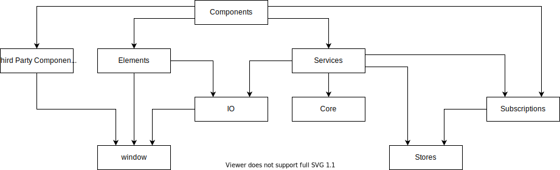

# Agile Avatars

Source code for [agileavatars.com](https://agileavatars.com), and experiment in frameworkless/vanilla JavaScript.

> Agile Avatars makes it quick and easy to know who's working on what with great looking avatars for your agile board. No more fiddling with Word or Google Docs making sure everything aligns just right. Simply drag and drop your images, make some adjustments, print, and laminate!

This is a hobby project I decided to double as an experiment in writing a web application in JavaScript without the aid of a framework like React or Angular. Such an approach is often referred to as frameworkless, or vanilla JavaScript.

## Architecture

### Architecture Components

#### Components

A __component__ function returns a [HTMLElement](https://developer.mozilla.org/en-US/docs/Web/API/HTMLElement) which may mutate or invoke services in reaction to user interaction and state changes.

Components may be composed of other components, elements, or third party components.

#### Elements

An __element__ function returns a [HTMLElement](https://developer.mozilla.org/en-US/docs/Web/API/HTMLElement) which may mutate in reaction to user interaction.

Elements are more fundamental than components. Unlike components, they cannot react to state changes or invoke services. For this reason, elements tend to be lower level, more generic and more reusable.

Elements may be composed only of other elements.

#### Third Party Components

A __third party component__ function returns a [HTMLElement](https://developer.mozilla.org/en-US/docs/Web/API/HTMLElement) controlled by a third party library. 

Like elements, they cannot react to state changes or invoke services. Rather they provide an interface consistent with components and elements.

#### Services

A __service__ function that orchestrates domain logic and IO including issuing state changes to state stores.

Inspired by [Functional Core, Imperative Shell](https://www.destroyallsoftware.com/screencasts/catalog/functional-core-imperative-shell), service functions may be characterised as imperative shells.

#### Core

A __core__ function is a pure function. 

Inspired by [Functional Core, Imperative Shell](https://www.destroyallsoftware.com/screencasts/catalog/functional-core-imperative-shell), core functions comprise the functional core.

#### IO

The __io__ object contains objects and functions that depend on the environment. 

#### Subscriptions

A __subscription__ function enables a listener to be notified of state changes.

#### Stores

A __store__ object encapsulates state mutations and notifications.

## Dependencies

### Production

#### @sentry/browser

The JavaScript SDK for Sentry, a cloud-based application monitoring service.

#### blueimp-md5

A JavaScript implementation of the md5 hashing algorithm.

Notes:
- Used to hash email addresses sent to Gravatar.

#### lodash

A JavaScript utility library.

Notes:
- Used by exception where there's no concise native JavaScript alternative.

#### module-composer

Enables dependency injection using currying.

Notes:
- I am the author of this library.

#### vanilla-picker

A vanilla JavaScript color picker. 

Notes:
- It was suprisingly hard to find a good looking, easy to use color picker writting in vanilla JavaScript. Many color pickers are implemented as jQuery plugins.
- I am using a fork which I have customised to accept a window object in order to avoid globals.

### Development

#### eslint

A static code analysis tool for identifying problematic patterns found in JavaScript code.

Notes:
- Also used for automatic code formatting.
- I had originally used prettier for code formatting but was regularly dissatisfied with the results.

#### jsdom

Emulates a web browser for testing web applications with Node.js.

Notes:
- I had originally used in conjunction with jsdom-global until I decided to strictly limit use of globals.

#### module-indexgen

Generates index.js files with Node.js.

Notes:
- I am also the author of this library.

#### nyc

A JavaScript test coverage tool.

#### parcel-bundler

A zero-configuration web application bundler.

Notes:
- I have found Parcel to be much simpler to use than webpack.

#### tap-summary

A TAP (Test Anything Protocol) reporter.

Notes:
- A benefit of TAP is the variety of reporters available.
- tap-summary output is minimal and includes duration of each test which is useful for keeping the tests fast.

#### tape

A very lightweight TAP producing test harness.
